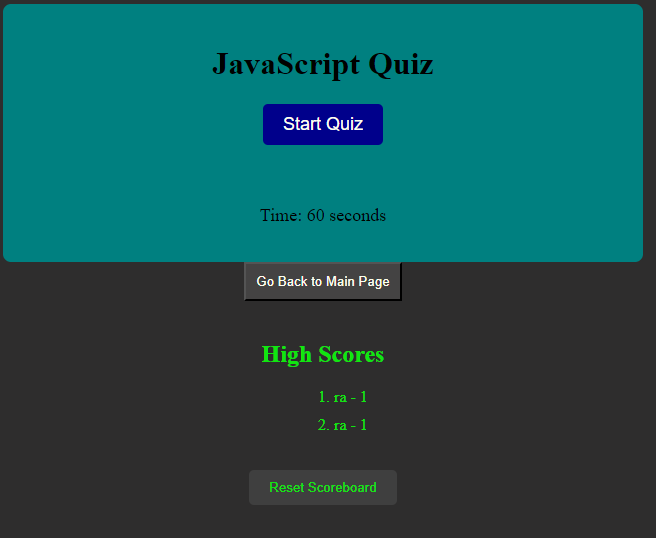

# Rays_Quiz_Project

## Description

The purpose of this project is to create a functioning quiz with a highscore system. 
This was effective in helping me learn more about doms, functions and eventlisteners.

## Installation

1. Clone the repository to your local machine: https://github.com/Wolffkran/Wolffkrans_Module_1_Project_3_Assignment.git

2. Navigate to the project directory: cd Rays_Quiz_Project

3. Open your web browser and visit `/Rays_Quiz_Project/index.html` to view the application.

## Usage

    
   

## License

© 2023 edX Boot Camps LLC. Confidential and Proprietary. All Rights Reserved.
